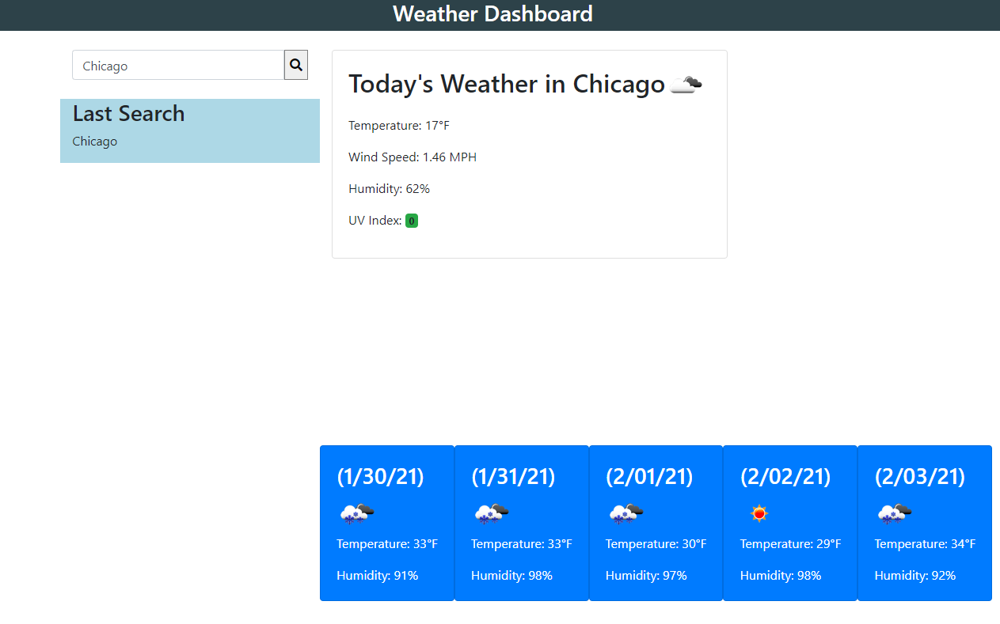

# Weather Dashboard
A webpage that accepts a City input and returns the weather information from OpenWeatherMap API. 

# How To
Enter a city into the search bar and click the search icon button. You will be presented with today's weather for that city which includes: an image, the temperature in Farenheit, the wind speed, humidity, and a color-coded UV index. Below the current weaterh, there is a 5 day forecast for the city which provides the date, icon, temperature, and humidity. The last searched city is stored to local storage and then appears under the 'Last Search' area of the page. Future developments will include a more extensive search history and provide the weather for the previously searched cities. 

# Link to live site: 
https://markkimeyer.github.io/weatherAPI/

